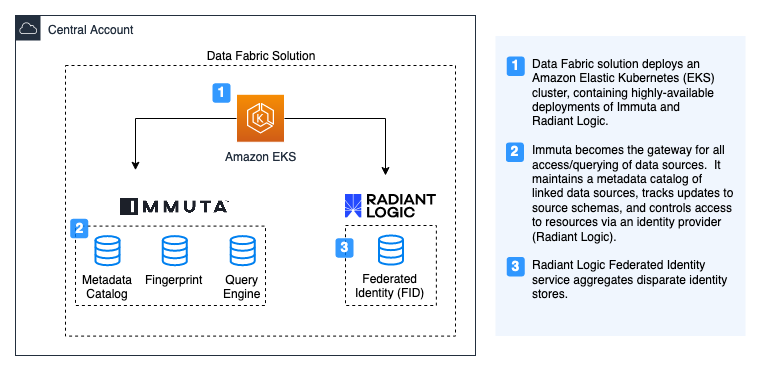
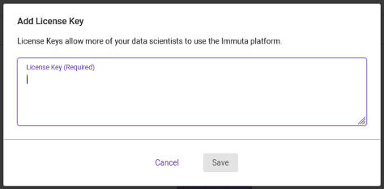
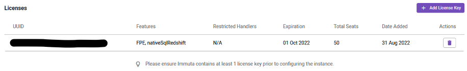

# Data Fabric Security on AWS
<!--BEGIN STABILITY BANNER-->

<!--END STABILITY BANNER-->

The Data Fabric Security on AWS solution delivers scalable data security and governance, enabling increased interoperability, modernization, and informed decision-making across a myriad of organizations and environments.  The solution is designed to address the challenges that many organizations face when attempting to securely share data across decentralized identities and centralized repositories.  The foundation of enabling customers like the Department of Defense to engage in decentralized data-centric sharing is to provision a set of common security services.  Data Fabric Security on AWS enables mission owners to quickly deploy a security substrate composed of centralized data governance and identity aggregation layers for secure interoperability across multiple security and operational domains.

## Architecture Overview

## Prerequisites
- Installed [Node.js](https://nodejs.org/en/) 10.13.0 or later
- Installed CDK CLI globally  
`npm install -g aws-cdk`
- Active license for Immuta
- Active license for Radiant Logic

## Getting Started
This project deploys the Data Fabric Solution which includes the EKS cluster, Immuta, and Radiant Logic.

### Building and Deploying the Solution
1. Navigate to the Data Fabric Security root folder.  
`cd <data-fabric-security-home>`
2. Install all packages.  
`npm install`
3. Configure solution for deployment. See [Deployment Configuration](#deployment-configuration) section for additional details.
4. Bootstrap CDK.  
`cdk bootstrap aws://<ACCOUNT_ID>/<REGION>`
4. Deploy solution using CDK.  
`cdk deploy`  
*Note: It takes about 40 minutes to deploy the solution.*

### Accessing the Solution
UI portals for Immuta and Radiant Logic can be accessed by navigating to the endpoints listed below on a browser. (Note: Replace `example.com` with your domain name that was used during deployment.)
- Immuta  
`https://immuta.example.com`

- Radiant Logic  
`http://radiantlogic.example.com:7070`
`https://radiantlogic.example.com:7171`

### Configuring Data Fabric Security
The following are manual configuration steps that are necessary to deploy the solution.

#### **1. Creating the Admin User Account**
Upon initial access to Immuta, you will be prompted to create an Admin user account. Complete the Admin user creation form and create the Admin user.

#### **2. Adding the License Key**
Once you create the Admin user, you will be prompted immediately to add the license key.
1. On the Add License Key modal view, copy and paste your License Key (from Immuta) into the text field.

2. Click on **Save**.
3. On successful configuration of the license key, you should see that your license has been added:

For details on adding data sources, visit the [Immuta Guide](docs/IMMUTA_GUIDE.md).

#### **3. Configuring the Identity Manager**
*Note: Before proceeding with this step, you will need to have created a [Global Profile](docs/RADIANT_LOGIC_GUIDE.md) in Radiant Logic.*

The Identity Manager is an offering in Immuta that provides "authentication and fine-grained user entitlement". Follow the steps below to configure Radiant Logic as the Identity Manager:
1. On the left side navigation, click on **App Settings**
2. Under **1 Identity Management** and inside **Identity and Access Management (IAM)**, click on **Add IAM**
3. Complete the **Credentials** section:
    - Bind DN:  
    *Example: `cn=ldap,cn=users,dc=example,dc=com`*
    - Bind Password: (leave blank if not created)
4. Complete the **Options** section:
    - Host:  
    fid-0.fid-headless.radiantlogic.svc.cluster.local
    - Port:  
    2389
    - User Search Base:  
    *Example: `o=global_identity_profile`*
    - User Attribute:  
    *Example: `sAMAccountName`*
5. Check the following checkboxes to enable:
    - Sync attributes from LDAP/Active Directory to Immuta
    - Make Default IAM

For more details on adding identity sources and configuring global profiles, visit the [Radiant Logic Guide](docs/RADIANT_LOGIC_GUIDE.md).

### Cleanup
1. Destroy solution using CDK  
`cdk destroy`

### Deployment Configuration
The deployment configuration for Data Fabric Security is defined in `<data-fabric-security-home>/config/dev.yaml`. This YAML file must be updated with all necessary values for the solution to be deployed successfully.

#### Global
| Parameter      | Description                               | Default |
| ---            | ---                                       | ---     |
| AWSAccountID   | ID of the AWS Account to deploy solution  | ""    |
| AWSRegion      |   AWS region to deploy solution     | ""    |
| Domain         |   Domain name that will be used for the solution       | ""    |

#### Networking
| Parameter      | Description                               | Default |
| ---            | ---                                       | ---     |
| VpcId   | ID of the AWS Account to deploy solution  | ""    |
| SubnetA      |       Private subnet in AZ1     | ""    |
| SubnetB         |    Private subnet in AZ2             | ""    |
| MaxAZs         |   Maximum availability zones        | 2    |

#### EKS
| Parameter      | Description                               | Default |
| ---            | ---                                       | ---     |
| EKSAdminRole   | Admin role ARN for EKS  | ""    |
| EKSEndpointAccess | EKS endpoint access type (Valid inputs are "PUBLIC", "PRIVATE", or "" for both)    | ""    |
| InstanceType         |      Instance type for the EKS cluster        | "m5.large"    |
| ClusterSize         |       Size of the EKS cluster      | 3    |

#### Immuta
| Parameter      | Description                               | Default |
| ---            | ---                                       | ---     |
| Deploy   | Boolean to deploy the component  | true    |
| Instance.Username      |    Immuta instance username      | ""    |
| Instance.Password         |   Immuta instance password              | ""    |
| Database.ImmutaDBPassword      |    Database password     | ""    |
| Database.ImmutaDBSuperUserPassword   | Database superuser password   | ""    |
| Database.ImmutaDBReplicationPassword | Database replication password | ""    |
| Database.ImmutaDBPatroniApiPassword  | Database Patroni API password | ""    |
| Query.ImmutaQEPassword            | Query engine password | ""    |
| Query.ImmutaQESuperUserPassword   | Query engine superuser password | ""    |
| Query.ImmutaQEReplicationPassword | Query engine replication password | ""    |
| Query.ImmutaQEPatroniApiPassword  | Query engine Patroni API password | ""    |

#### Radiant Logic
| Parameter      | Description                               | Default |
| ---            | ---                                       | ---     |
| Deploy   | Boolean to deploy the component  | true    |
| License      | License for Radiant Logic  | ""    |
| RootPassword         |  Password to be used for the root admin user   | ""    |

## Troubleshooting
### Radiant Logic license not working
The curly braces need to be escaped before it can be consumed.  
Example: `"\\{rlib\\}RADIANT_LOGIC_LICENSE"`

---

For any feedback on Data Fabric Security, please contact us at aws-dod-solutions-team@amazon.com.